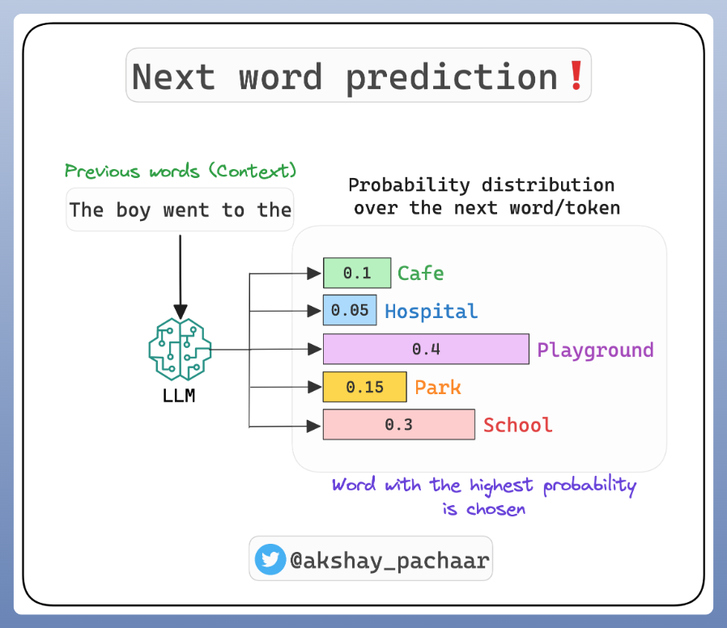
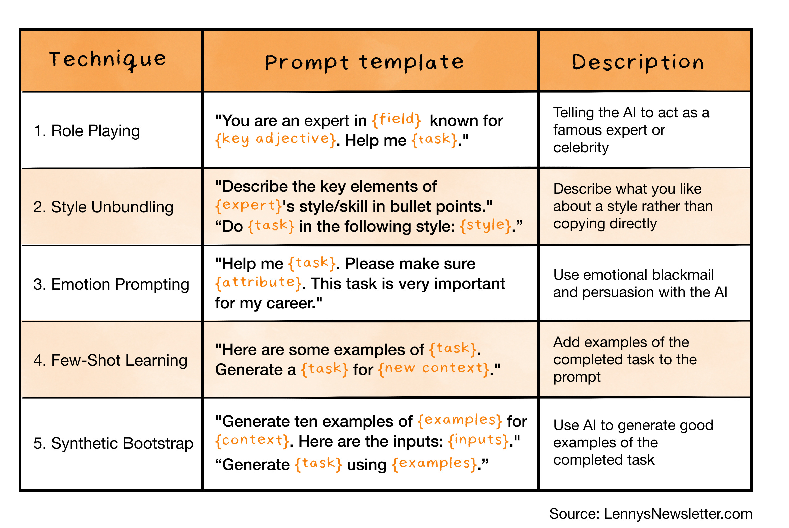
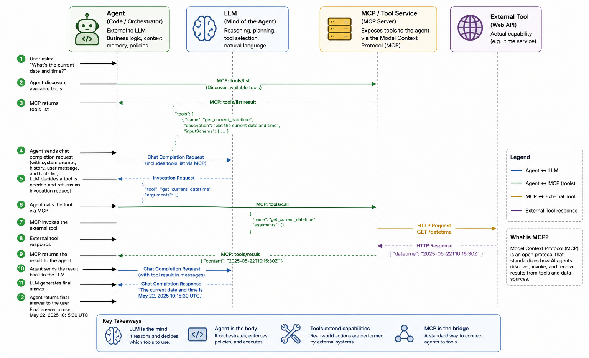
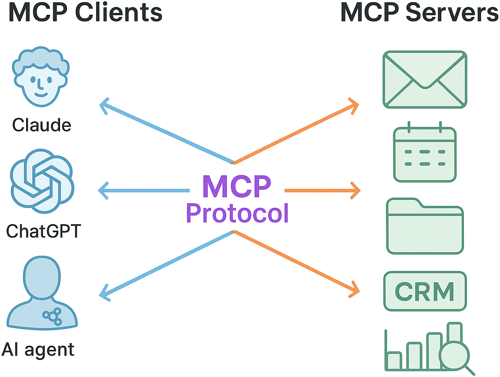
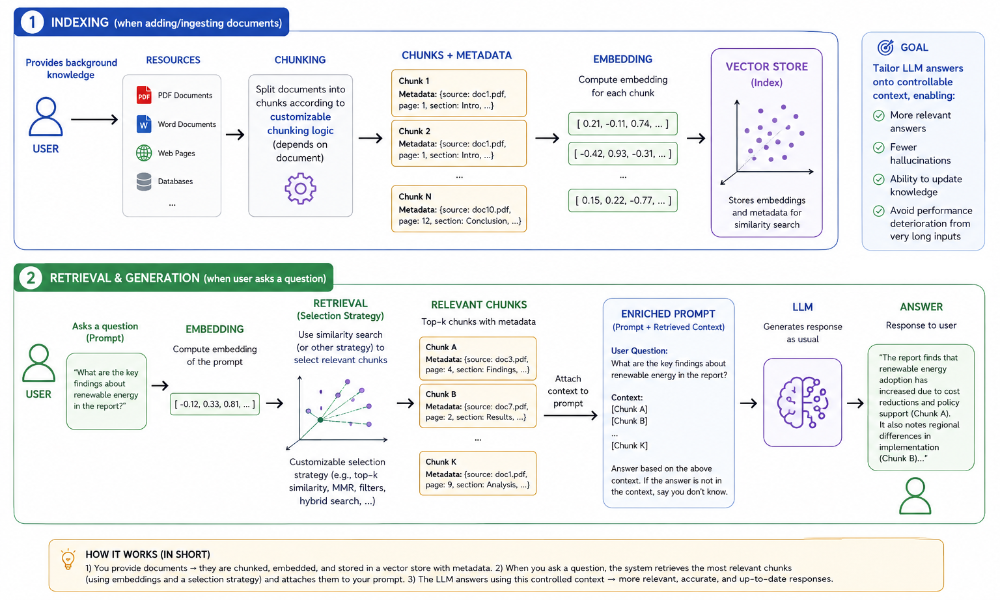
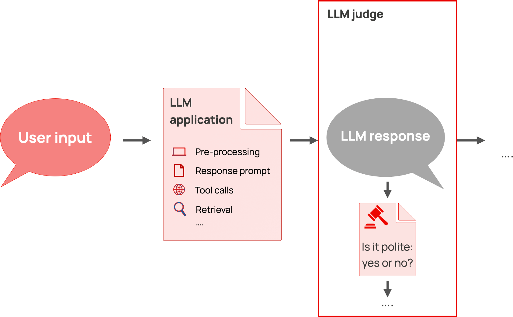
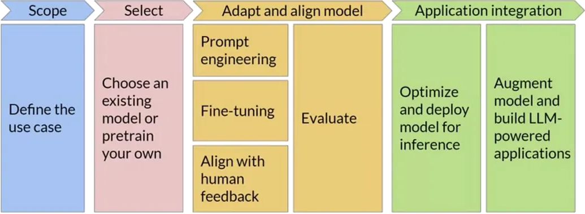

+++

title = "[ISE] Generative AI 101"
description = "Gentle Introduction to Generative AI"
outputs = ["Reveal"]

+++

# Generative AI 101

{}

---



## __GenAI__: _Generative_ Artificial Intelligence

<!-- > [Systems based on] <br> -->
_AI_ algorithms capable of __automatically generating__ _content_, e.g.:
- _text_
- images
- audio and/or video
- [source] code
- ...

(cf. [Policy for the ethical and responsible use of Generative Artificial Intelligence in teaching and research activities](https://www.unibo.it/it/allegati/policy-per-un-uso-etico-e-responsabile-dell2019intelligenza-artificiale-generativa-nelle-attivita-di-didattica-e-ricerca/@@download/file/Policy-Generative-AI.pdf))

---

## GenAI through _Foundation Models_ (FM)

+ Large _neural networks_ that learn to _process_, _"understand"_, and _produce_ [not necessarily] __structured__ and __unstructured__ data
+ __trained__ on _large_ amounts of data, and with _large_ computational resources, to __do a bit of everything__
    - with the idea that they can later be __specialized__ for _specific tasks_

<br>


---

## __Terminology__: Foundation Models vs. _Large Language Models_



---

## Basic Operation of LLMs

<!--  -->


- LLMs have learned to __predict__ the _next word_ in a _text_ given the _previous context_
    * similar to the _predictive_ keyboard on mobile phones, but much more _complex_ and _powerful_
- In other words, LLMs have learned how to use __natural language__
- Foundation models can combine input/output text with other modalities (e.g. images, audio, video)
    * e.g. accepting text + image as input, and producing text + image as output, or any combination of these modalities
- This makes them very good at dealing with __unstructured__ data, either in input or output

---

## Language and Reasoning

- __Natural language__ helps people _communicate_

- It can be used to express _complex_ or _abstract_ concepts

- It can be used to _reason_ about _problems_ and _solutions_
    - however it admits __imprecisions__, due to _ambiguity_, variable interpretations, subjectivity, etc.


> Natural language allows LLMs to use __intuition__ in _reasoning_, like humans do
> <br> (thus __making mistakes__ like humans do)
- $\implies$ LLMs can be very confident in themselves, while saying _incorrect_, _imprecise_, or _made-up_ things

- better would be to combine LLMs with __symbolic__ AI tools, to get the best of both worlds

---

## Analogy with Dual-System theory



(cf. [Thinking, Fast and Slow](https://en.wikipedia.org/wiki/Thinking,_Fast_and_Slow))

---

{}

## GenAI with an _as-a-Service_ consumption model



---

## GenAI with an _as-a-Service_ consumption model

- __Cost__ models:
    + __subscription-based__: you pay a fixed monthly/annual _fee_ to access the service
        * it often still includes _usage_ limits
    + __usage-based__: you pay _in proportion_ to the actual use of the service

- __Consumption__ is measured based on the _computational effort_ required to serve the request:
    + processed _tokens_ (for text)
    + number of _requests_ made per unit of time (minute, hour, day, month)
    + _size_ of the processed data (for images, audio, video)
    + _complexity_ of the specific _model_ used to serve the request

- __Generation__ should be considered a _stochastic_ process by construction

{}
> - The __quality__ of the service is subject to randomness and _fluctuations_ due to:
>    + service _load_
>    + model choice, and its related _updates_
>    + service _limits_ possibly reached in the current _time window_
>    + chance
{}

{}

---

{}

## GenAI _learning_ cycle



---

## GenAI _learning_ cycle — __Consequences__ (pt. 1)

- __Sampling__ __bias__: GenAI knows _only_ what it has been _trained_ on + the pious hope that it learns to _generalize_

- Learning uses data taken __from the Web__ + possible provider-owned __company data__
    + there is documented use of previous users' _interactions_ as _feedback_ for subsequent training

{}
##

> - __Niche__ information may <u>not</u> be learned correctly (or at all)
> - It is essential to __avoid sharing__ _sensitive_, _confidential_, or _copyrighted_ information
{}

---

## GenAI _learning_ cycle — __Consequences__ (pt. 2)

- Learning cycles are extremely __expensive__ in terms of _money_ and _computational resources_...

- ... performed __periodically__ (weeks? months?) to improve the _quality_ of the service
    + the _as-a-Service_ consumption model gives the user transparent access to the _updated_ service


{}
##

> - __Recent__ information may <u>not</u> have been _learned_ yet
> - There is a risk of receiving __outdated__ or _incomplete_ answers from GenAI
> - GenAI gives the _impression_ of learning __during the conversation__, but it actually does so _offline_
{}

---

## Some technological solutions let you _choose_ (pt. 1)


<br/>


---

## Some technological solutions let you _choose_ (pt. 2)


<br/>


---

## Some technological solutions let you _choose_ (pt. 3)


<br/>


---

## Some technological solutions let you _choose_ (pt. 4)


<br/>


{}

---



# Main __technological__ solutions

## Categorized by type of __interface__

- _Conversational_: e.g. [ChatGPT](https://chatgpt.com/), [Claude](https://claude.ai/login?returnTo=%2F%3F), [Scite](https://scite.ai)
- _Auto-completion_: e.g. [GitHub Copilot](https://github.com/features/copilot)
- _Programmatic_: e.g. [OpenAI Platform](https://openai.com/api/), [Hugging Face](https://huggingface.co/)
- _In-App_: e.g. [Microsoft 365 Copilot](https://www.microsoft.com/it-it/microsoft-365/copilot?market=it)
- _Audio/video editing_: e.g. [Suno](https://suno.com/), [Runway](https://runwayml.com/)
- _Inspection of generated material_: e.g. [GPTZero](https://gptzero.me/), [ZeroGPT](https://www.zerogpt.com/)

{}Non-exhaustive list!{}

---

## __Conversational__ interface

{}
{}


{}
{}
<br>

- _Textual_ interaction that mimics a (__chat__) _exchange_
    + the user asks, the AI responds _reactively_
- The interface allows entering a __prompt__
    + optionally including _attachments_ (e.g. images, documents)
- Responses are __contextual__
    + i.e., the conversation _history_ affects _future_ responses
- The response contains __text__ (often _formatted_)
    + optionally: _images_, URLs, code

{}

### Sometimes...

- ... before responding, the AI performs a __Web__ _search_
- important for obtaining _up-to-date_ results

{}

{}
{}

---

## __Auto-completion__ interface

{}
{}


{}
{}
<br>

- The AI _suggests_ a __completion__ for the entered text
    + e.g., code, text, URLs
- The user __accepts__ (even partially) or _ignores_ the suggestion
- Used especially for __programming__ _code_

{}

### Attention...
- ... __subscription__ pricing model (see [here](https://github.com/features/copilot/plans))
- ... potential __leaks__ of _sensitive_ information
- ... non-negligible __lock-in__ risk

{}

{}
{}

---

## __Programmatic__ interface

{}
{}

```python
import asyncio
from openai import AsyncOpenAI

client = AsyncOpenAI(api_key="sk-1234567890abcdef1234567890abcdef")

async def main():
    stream = await client.chat.completions.create(
        model="gpt-4",
        messages=[
            dict(role="user",
                 content="European countries, one by line")
        ],
        stream=True,
    )
    async for chunk in stream:
        print(chunk.choices[0].delta.content or "", end=", ")

asyncio.run(main())
```

Output:
```plaintext
Albania, Andorra, Austria, Belarus, Belgium, Bosnia and Herzegovina, Bulgaria, Croatia, Cyprus, Czech Republic, Denmark, Estonia, Finland, France, Germany, Greece, Hungary, Iceland, Ireland, Italy, Kosovo, Latvia, Liechtenstein, Lithuania, Luxembourg, Malta, Moldova, Monaco, Montenegro, Netherlands, North Macedonia, Norway, Poland, Portugal, Romania, Russia, San Marino, Serbia, Slovakia, Slovenia, Spain, Sweden, Switzerland, Turkey, Ukraine, United Kingdom, Vatican City (Holy See),
```
{}
{}

- __Programming language__ interacting with AI
    + e.g., _Python_, JavaScript

- The interaction remains of the _request-response_ type
    + the __program__ sends a _request_, the AI _responds_

{}

### Enables

- __Parametric__ prompts, responses processed _automatically_
    + e.g. `list of LOCALITIES in AREA, one by line`
        + where `LOCALITIES` $\in$ {`cities`, `regions`, `states`}
        + and `AREA` $\in$ {`Europe`, `Asia`, `Africa`, `America`, `Oceania`}
        + results _sorted alphabetically_

- Writing __software__ that uses AI as a __service__
    + useful in both _industry_ and _research_

{}

{}

### Attention...
- ... __usage-based__ pricing model (see [here](https://openai.com/api/pricing/))
    + proportional to the number of processed _tokens_
    + prices vary _by model_

{}

{}
{}

---

## __In-app__ interface

{}
{}


{}
{}
<br>

- GenAI integrated into __desktop__ or _web_ __applications__
    + e.g., _Microsoft Office_ (Word, Excel, Outlook)

- support for an internal __conversational__ interface
    + a conversation that is intrinsically _contextualized_

- AI __automates__ _complex operations_ (within the app)
    + e.g., draft _writing_
    + e.g., _generation_ of formulas, charts

{}

### Attention...
- ... __subscription__ pricing model (see [here](https://www.microsoft.com/it-it/microsoft-365/copilot?market=it#plans))
- ... potential __leaks__ of _sensitive_ information
- ... non-negligible __lock-in__ risk

{}

{}
{}

---

## Interface for __editing__ audio/video content (e.g. _music_)

{}
{}


{}
{}
- __One-shot__ interaction to generate content
    + _input_: textual description of the content
    + _output_: content

- The interface then allows
    + _playback_ of the content
    + __editing__ of the content
        + e.g., _cutting_ parts, _changing_ key

{}

### Example

- ["Song of Bacchus" (Lorenzo de' Medici, 1490)](https://it.wikipedia.org/wiki/Il_trionfo_di_Bacco_e_Arianna_(poesia)), rock
    + <https://suno.com/song/cce33ee7-a581-47ae-b9d1-806902e88e47>

{}
{}
{}

---

## What do engineers do with GenAI?

Combine _prompts_, _tools_, _vector stores_, and _agents_ to constrain and govern the behavior of __pre-trained__ (_foundation_) models, in order to:
- __generate__ contents (text, images, code, etc.) for a specific purpose
    * e.g. bring unstructured data into a particular format
    * e.g. produce summaries, reports, highlights
- __interpret__ unstructured data and _grasp information_ from it
    * e.g. extract entities, relations, sentiments
    * e.g. answer questions about a document
- __automate__ data-processing tasks which are _hard to code_ explicitly
    * e.g. the task is ill-defined (`write an evaluation paragraph for each student's work`)
    * e.g. the task requires mining information from unstructured data (`find the parties involved in this contract`)
    * e.g. the task is complex yet too narrow to allow for general purpose coding (`plan a vacation itinerary based on user preferences`)
- __interact__ with users via _natural language_
    * e.g. chatbots, virtual assistants

---

## Let's explain the nomenclature

- __<u>Pre-trained</u> foundation models__ (PFM): large neural-networks trained on massive datasets to learn general skills (e.g. 'understanding' and generating text, images, code), most commonly accessed -as-a-Service- via API, as provided by third-party companies
    * e.g. GPT, PaLM, LLaMA, etc.

- __Prompts__: carefully _crafted textual inputs_ that guide some PFM to produce _desired outputs_
    * prompt __templates__ are prompts with _named placeholders_ to be filled with specific data at runtime
        + e.g. `Write a summary of the following article: {article_text}`

- __Tools__: external _software components_ (e.g. WebAPIs, databases, search engines) that can be _invoked_ by PFMs to perform specific tasks or retrieve information
    * e.g. a calculator API, a weather API, a database query interface

- __Vector stores__: specialized databases that store and retrieve _high-dimensional vectors_ (embeddings) for the sake of _information retrieval_ via _similarity search_
    * e.g. to support _retrieval-augmented generation_ (RAG)

- __Agents__: software systems that _orchestrate_ the interaction between PFMs and tools, enabling dynamic decision-making and task execution based on the context and user input
    * e.g. a chatbot that uses a PFM for conversation and invokes a weather API when asked about the weather
    * e.g. an assistant that uses a PFM to understand user requests and a database to fetch relevant information

---

{}

## What does an AI-powered application include?

0. FM are commonly <u>not</u> produced in-house, but rather _accessed_ via APIs... yet the choice of __what model(s) to use__ is crucial
    * must be available, configured, and most commonly imply _costs_ (per call, per token, etc.)
    * imply the choice of some __client library__, and the related _programmatic interface_
        + e.g. [OpenAI Python SDK](https://github.com/openai/openai-python), [Hugging Face Transformers](https://huggingface.co/docs/transformers/index), etc.

1. A set of __prompt templates__ (text files, or code snippets) that are known to work well for the tasks at hand
    * commonly assessed via semi-automatic _evaluations_ on a _validation set_ of inputs

2. A set of __tool servers__ implementing the [MCP protocol](https://modelcontextprotocol.io/docs/getting-started/intro) so that tools can be _invoked_ by PFMs
    * these are _software modules_, somewhat similar to ordinary Web services, offering one endpoint per tool

3. A set of __agents__, implementing the logic to orchestrate the interaction between PFMs and tools
    * these are _software modules_, commonly implemented via libraries such as [LangChain](https://python.langchain.com/en/latest/index.html) or [LlamaIndex](https://gpt-index.readthedocs.io/en/latest/)

4. A set of __vector stores__ (if needed), populated with relevant data, and accessible by the agents
    * there are _software modules_, somewhat similar to ordinary DBMS, offering CRUD operations on data chunks _indexed by_ their _embeddings_

5. LLM-as-a-Judge __evaluations__ to assess the quality of the outputs produced by the system, and to guide the improvement of prompts, tools, and agents
    * e.g. by comparing the output to a _reference_ answer, and by assigning a score based on some _criterion_

---

## Concept: Prompt Templates



---

## Concept: Agents Calling External Tools



---

## Concept: Model-Context Protocol (MCP)

<!--  -->


- MCP $\approx$ _standard_ protocol for LLM-based agents to _call_ __external tools__
- Allow for _decoupling_ between the agent's logic and the implementation of the tools, thus enabling modularity and interoperability
- Most commonly there is a __server__ (a.k.a. _gateway_) where tools are registered (names, purpose, data schemas, etc.)
- Clients are agents willing to _discover_ or _invoke_ tools provided by some server

---

## Concept: Retrieval-Augmented Generation (RAG)



---

## Concept: LLM-as-a-Judge

<!--  -->


- Exploiting an LLM to _evaluate_ the quality of some other LLM's output...
- ... based on some _informal_ __criterion__ (e.g. _relevance_, _accuracy_, _completeness_, etc.)
- ... by comparing the output to some _reference_ (e.g. a human-written checklist)

{}

---

{}

## The GenAI workflow

(Similar to the ML workflow in the sense that the goal is to process data, but different in many details e.g. _no training_ is involved)



* there could be __many iterations__ (e.g. for PFM selection, and prompt tuning)
* the whole workflow may be __re-started__ upon _data changes_, or _task changes_, or new _PFM availability_
* the __interplay__ between prompts, models, tasks, and data may need to be _monitored_ and _adjusted_ continuously
* the __data-flow__ between components (agents, PFM, tools, vector stores) may need to be _tracked_ for the sake of _debugging_ and _monitoring_

---

## Peculiar activities in a typical GenAI workflow

1. __Foundation model selection__: choose the most suitable pre-trained model(s) based on task requirements, performance, cost, data protection, and availability
    * implies trying out prompts (even manually) on different models

2. __Prompt engineering__: design, test, and refine prompt templates to elicit the desired responses
    * implies engineering variables, lengths, formats, contents, etc

3. __Evaluations__: establish assertions and metrics to assess PFM responses to prompts (attained by instantiating templates over actual data)
    * somewhat similar to _unit tests_ in ordinary software
    * important when automatic, as they allow quick evaluations on prompt/model combinations

4. __Tracking__ the _data-flow_ between components (agents, PFM, tools, vector stores) to monitor _costs_, _latency_, and to _debug_ unexpected behaviors
    * also useful for the sake of _auditing_ and _governance_
    * commonly performed via _logging_ and _tracing_ tools, e.g. [LangSmith](https://smith.langchain.com/), or [MLflow](https://mlflow.org/)

---

## Example of GenAI workflow (pt. 1)

> Support public officers in managing tenders through a GenAI assistant that understands and compares procurement decisions transparently.

1. __Problem Framing__:
    - _Content Generation_: draft and justify _comparisons_ among suppliers’ offers vs. technical specs
    - _Interpretation_: understand regulatory documents and technical language
    - _Automation_: retrieve relevant laws, norms, and prior tender examples
    - _Interaction_: enable officers to query and validate results through natural language

2. __Data Collection__: past tenders' technical specifications, acts, etc; regulatory documents, etc.

3. __Data Preparation__:
    - devise useful data schema & extract relevant data from documents
    - anonymize sensitive info (suppliers, personal data)
    - segment documents and index by topic (law, SLA, price table, etc.)

---

## Example of GenAI workflow (pt. 2)

4. __Prompt Engineering__:
    1. design prompt templates for comparison, justification, and Q&A
        * use role-based system prompts (`You are a procurement evaluator…`)
    2. allocate placeholders for RAG-retrieved data chunks
    3. iterate on template design based on manual tests

5. __Foundation Model Selection__: multi-lingual? specialized in legal/technical text? cost constraints? support for tools?

6. __Vector stores__: storing embeddings for tender documents & specs, legal texts & guidelines, previous evaluation, templates
    1. choose embedding model, chunking strategy, and populate vector store
    2. engineer retrieval strategies to fetch relevant chunks

8. __Tools__:
    * regulation lookup API + tender database query API
    * report generation out of document templates
    * automate scoring calculations via spreadsheet or Python scripts generation

9. __Agents__:
    1. exploit LLM to extract structured check-lists out of technical specs
    2. orchestrate RAG, tool invocations, and prompt templates to score each offer
    3. generate comparison reports
    4. ...

{}

---

{}
