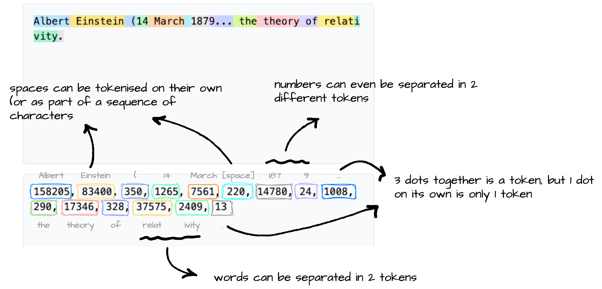

+++

title = "[ISE] LLM-as-a-Service"
description = "Background about using LLMs via Service Providers"
outputs = ["Reveal"]

+++

# Using LLMs via Service Providers

{}

---

## Outiline

### Key engineering aspects of LLM-as-a-Service

0. **On-premise** vs. **On-cloud** deployment
    - On-premise: the model is hosted and run on the _user's own infrastructure_, commonly via _containerized solutions_ (e.g. [Ollama](https://ollama.com/), [Docker's Model Runner](https://www.docker.com/products/model-runner/), etc.)
        + implies ad-hoc _hardware requirements_ (e.g. Nvidia GPUs, Apple Silicon) and technical expertise for setup and maintenance
        + the service provider is commonly the company providing the _containerized solution_, and making _models_ available for _download_ and use
        + most commonly, containerized solutions provide the same _API_ as the on-cloud service, to facilitate migration between the two deployment options
    - On-cloud: the model is hosted and run on the _service provider's infrastructure_, and accessed via _API calls_
        + implies _<u>no</u> hardware requirements_ for the user, but a _cost per usage_ (e.g. per token, per request, etc.)

1. **Service Provider**: several exist, with different offerings in terms of models, pricing, and features
    - e.g. [OpenAI](https://openai.com/), [Anthropic](https://www.anthropic.com/), [Google](https://cloud.google.com/vertex-ai), [Microsoft](https://azure.microsoft.com/en-us/services/cognitive-services/), [Hugging Face](https://huggingface.co/inference-api), or aggregators like [OpenRouter](https://openrouter.ai/)
    - the choice of the service provider can depend on several factors, including:
        + the availability of _specific models_ (e.g. GPT-4, Claude, Gemini, etc.)
        + the _pricing model_ and cost structure
        + the _features_ and _capabilities_ offered (e.g. fine-tuning, custom models, MCP support, etc.)

1. **Web API Compatibility**: early providers (e.g. OpenAI, Google) invented _their own APIs_, similar in the spirit, but _different in syntax_
    - some later providers attempted to adopt the _same API_ as the _market leader_ (OpenAI), to facilitate adoption
        * others (e.g. HuggingFace) come with their own API, which may be more or less compatible with OpenAI's API
    - API compatibility is key for _provider interchangeability_, hence allowing migration and __avoiding vendor lock-in__

1. **Client Libraries**, in target _programming languages_ wrap Web API clients and make it easier to use _LLMs programmaticatically_
    - here you may care about which programming languages (e.g. Python, JS, Java, etc.) are supported by some given client library...
        * most commonly, the same provider implements the same meta-model onto different target programming languages (e.g. OpenAI' client is available in Python, JS, Java, etc.)
    - there exist also _third-party_ client libraries, which may support multiple Web APIs, and therefore multiple providers (e.g. [LangChain](https://python.langchain.com/en/latest/))

---

{}

## About Ollama (cf. <https://ollama.com/>)

- Ollama is a company that provides a _containerized_ solution for _hosting_ and _running_ LLMs __on-premise__, with a focus on ease of use and accessibility

- It offers a [model zoo](https://ollama.com/models) with several pre-trained models available for _download_ and use
    + plus a _native API_ that is _partially compatible_ with OpenAI's API, to facilitate migration between on-premise and on-cloud deployments

- Ollama's solutions can be used on various __hardware__ & __OS configurations__, including _Nvidia_ GPUs and _Apple Silicon_ as well as _Linux_, _MacOS_, and _Windows_

- Ollama's API supports both a native __CLI conversational interface__ and a __Web API__ for programmatic access, making it versatile for different use cases and user preferences

- Ollama may also be used an [on-cloud service](https://ollama.com/pricing), but here we will focus on the on-premise deployment option alone
    + three levels of premiumships (0€/month, 20€/month, 100€/month) with widening rate limitations

---

## On-premise Example with Ollama pt. 1

0. Ensure you have the __required hardware__ (e.g. Nvidia GPU, Apple Silicon, etc.)
    + details and configuration caveats: <https://docs.ollama.com/gpu>

1. __Install__ Ollama on your machine:

    ```bash
    brew install ollama # For macOS (Apple Silicon)
    curl -fsSL https://ollama.com/install.sh | sh # For Linux
    irm https://ollama.com/install.ps1 | iex # For Windows (PowerShell)
    ```

2. Activate the Ollama __service__ in some shell (alternatively, configure a _deamon_ to run it in background):

    ```bash
    ollama serve
    ```

---

## On-premise Example with Ollama pt. 2

3. Have a look to Ollama's __model zoo__ on <https://ollama.com/models>, and __select__ some model you like among the many variants available
    * notice naming convention: `model:variant`, most commonly the variant denotes the size of the model

    
    

---

## On-premise Example with Ollama pt. 3

4. Pick one model, e.g. `gemma4:e2b`, and __pull__ it:

    ```bash
    ollama pull gemma4:e2b
    ```

5. You may use Ollama's native __CLI conversational interface__ to try the model out:

    ```bash
    ollama chat gemma4:e2b
    ```

    example of conversation (notice that the model is also showing its _thinking process_):

    ```text
    >>> ciao!
    Thinking...
    Thinking Process:

    1.  **Analyze the input:** The input is "ciao!". This is an informal Italian greeting, meaning "hello!".
    2.  **Determine the appropriate response:** Since the user initiated a friendly greeting, the response
    should also be a greeting, ideally reciprocating the language or offering a friendly follow-up.
    3.  **Formulate the response (in Italian):** The simplest and most common reply is "ciao" (hello/hi) or
    a slightly expanded version.
    4.  **Add a standard conversational element (optional but good practice):** Asking how the user is doing
    is polite. ("Come stai?" / "Come va?")
    5.  **Final selection:** A friendly, standard reply.

    *Self-Correction/Refinement:* Keep it warm and open-ended.

    *Output Generation:* Ciao! Come stai? (Hello! How are you?)
    ...done thinking.

    Ciao! Come stai? 😊
    ```

---

## On-premise Example with Ollama pt. 3

6. Should you ever want to use the model _programmatically_, you can use Ollama's __API__, which is _partially_ compatible with OpenAI's API
    * e.g. it supports the same `/v1/chat/completions` endpoint, but not all the features of OpenAI's API, e.g. fine-tuning, custom models, etc.
    * in the client program, recall to set the __API base URL__ to point to your local Ollama service (by default: <http://localhost:11434>)
    * to prove that the API is working, you can send a test request via `curl`:

        ```bash
        curl -X POST "http://localhost:11434/v1/chat/completions" \
            -H "Content-Type: application/json" \
            -d '{
                "model": "gemma4:e2b",
                "messages": [
                    {"role": "system", "content": "You are a helpful assistant."},
                    {"role": "user", "content": "What is the capital of France?"}
                ]
            }'
        ```

        result (converted in YAML for the sake of readability):

        ```yaml
        id: chatcmpl-85
        object: chat.completion
        created: 1779435598
        model: gemma4:e2b
        system_fingerprint: fp_ollama
        choices:
        - index: 0
            message:
            role: assistant
            content: The capital of France is **Paris**.
            reasoning: |-
                Thinking Process:

                1.  **Analyze the Request:** The user is asking a factual question: "What is the capital of France?"
                2.  **Identify the Knowledge Needed:** I need to retrieve the capital city of France.
                3.  **Recall/Retrieve the Fact:** The capital of France is Paris.
                4.  **Formulate the Answer:** Provide a direct and accurate answer.
                5.  **Final Review:** The answer is correct and directly addresses the query. (Capital of France = Paris).
            finish_reason: stop
        usage:
        prompt_tokens: 29
        completion_tokens: 121
        total_tokens: 150
        ```

{}

---

{}

## About Open Router (cf. <https://openrouter.ai/>), pt. 1

- Open Router (_OR_) is a company that provides an __on-cloud__ service for using _LLMs as services_, with a focus on _provider interchangeability_

- Its distinguishing feature is that it acts as an _aggregator_ of multiple service providers, allowing users to access a variety of models from different providers via a single API, and helping to avoid vendor lock-in
    + one can use OR for __free__, with _very limited rates_ (20 requests per minute, max 50 per day)
        * one may __buy credits__ to widen the limitations for free models (see <https://openrouter.ai/docs/api/reference/limits> for details), or to use _pay-per-use_ models

- Pretty rich [model zoo](https://openrouter.ai/models), exposing models from <u>many</u> different providers, most notably: OpenAI, Anthropic, Google, xAI, Mistral, etc.
    + notice that models come with __price-per-token__, commonly expressed a `$/1M tokens` (some times the prices is different for _input_ or _output_ tokens)
        * this is very common for on-cloud services, and it is the main reason why we need to be careful when experimenting with them, to avoid unexpected costs

    

---

## About Tokenization

You may think that __token $\approx$ word__, but this actually depends on the specific [tokenization algorithm](https://huggingface.co/docs/course/it/chapter2/4) (tokenizer) being used by a model



---

## About Open Router (cf. <https://openrouter.ai/>), pt. 2

- Models in OR's zoo are __named__ according to the following convention: `provider/model` followed by _optional_ `:tier`, where:
    + `provider` is the name of the service provider (e.g. `openai`, `qwen`, `google`, etc.)
    + `model` is the name of the model _variant_ as provided by the provider (e.g. `gpt-oss-120b`, `qwen3-coder`, `gemma-4-26b-a4b-it`, etc.)
    + `tier` is an optional suffix that denotes a specific variant of the model (most commonly `free` for free models)


- To allow for __dynamic routing__ of requests to different providers in a _transparent_ way, OR allows for the following meta-models:
    + `openrouter/auto` ([AutoRouter](https://openrouter.ai/openrouter/auto)): let OR decide which provider/model to use for each request, based on the request's content and the current availability of models
    + `provider/*` (e.g. `anthropic/*`, `google/*`, etc.): OR will serve each request with the best available model from the specified provider, according to the request's content and the current availability of models
    + in general, you can reason like with Unix globs, so for instance `openai/gpt*` will match any OpenAI model whose name starts with `gpt` (as currently provided by OR)
    + in the [routing settings](https://openrouter.ai/workspaces/default/routing) of your OR account, you can set up the __routing strategy__ OR should adopt:
        1. __"Price"__ (cost-first): OR will route requests to the currently _cheapest_ model that can serve them
        2. __"Latency"__: OR will route requests to the model that is _currently quicker_ to respond
        3. __"Throughput"__: OR will route requests to the one that has currently the best stats in terms of _throughput_ (requests per minute)
        4. __"Exacto"__ (quality-first): OR will route requests to the _best available_ model that can serve them (based on model's stats on tools usage)

- __Bring your own API key__ (BYOK): OR allows you to _link_ your account with your API keys from _other providers_ so that you can use OR's API to access models from those providers, and therefore be charged according to the prices of those providers instead of OR's prices
    + this is a great feature to avoid vendor lock-in, and to have more control over the costs and the models you want to use

> Dynamic routing and BYOK are _peculiar_ features of OR, for the rest it's an "ordinary" on-cloud provider

---

## On-cloud Example with Open Router (pt. 1)

1. __Sign up__ & _log in_ for an account on Open Router: <https://openrouter.ai>
    + easier to re-use your GitHub account

2. Optionally add __payment methods__ and _credits_ to your account in <https://openrouter.ai/settings/credits>
    + no credit needed for this lecture
    + recall to set _expense limitation_ to avoid unexpected costs, in case you decide to experiment with actual money

    

---

## On-cloud Example with Open Router (pt. 2)

3. From time to time, keep an eye on the __activity dashboard__ of your account, to check the usage and the costs of your requests: <https://openrouter.ai/activity>

    

---

## On-cloud Example with Open Router (pt. 3)

4. To use OR's models programmatically, you need to create an __API key__ first (to be stored securely, and not shared with anyone else)
    * (i.e. an _authentication token_ to let clients authenticate on your behalf)
    * you can do that for the _default workspace_ at <https://openrouter.ai/workspaces/default/keys>
        + __workspaces__ are OR-wise _administration domains_, inside which configurations rules (e.g. routing rules, cost limits, etc.) apply

    

    + an API key is a string of the form: `sk-or-XXXXXXXXXXXXXXXXXXXXXXXX`: it is sufficient to <u>consume your credit</u> and to make requests on your behalf

---

## On-cloud Example with Open Router (pt. 4)

5. You may test your API key with a simple `curl` request:

    ```bash
    curl -X POST "https://openrouter.ai/api/v1/chat/completions" \
        -H "Content-Type: application/json" \
        -H "Authorization: Bearer YOUR_API_KEY" \
        -d '{"model": "openrouter/auto", "messages": [{"role": "user", "content": "What is the capital of France?"}]}'
    ```

    answer (converted in YAML for the sake of readability):

    ```yaml
    id: gen-1779447979-077vepCYJjlgJfXKnK2q
    object: chat.completion
    created: 1779447979
    model: openai/gpt-5-nano-2025-08-07
    provider: OpenAI
    system_fingerprint: null
    service_tier: default
    choices:
      - index: 0
        logprobs: null
        finish_reason: stop
        native_finish_reason: completed
        message:
          role: assistant
          content: Paris.
          refusal: null
          reasoning: '**Providing the capital of France**


            The user asked a straightforward question: "What is the capital of France?"
            The answer is simple: Paris. I should respond concisely. My best guess is
            to confirm: "The capital of France is Paris." While adding context could be
            fun, it’s not necessary since the user didn’t request it. If I wanted to be
            helpful, I could mention that Paris is the largest city and home to famous
            landmarks like the Eiffel Tower, but I’ll keep it brief.**Confirming details
            on Paris**


            I can keep my response short and straightforward. The user asked about the
            capital of France, and I can simply say: "Paris." If I want to offer more,
            I could say, "The capital of France is Paris." I think that covers it! But
            if they are interested, I could mention I''m happy to share more details about
            Paris if they''d like. For now, I’ll stick with the essential answer.'
    usage:
      prompt_tokens: 13
      completion_tokens: 243
      total_tokens: 256
      cost: 9.785e-05
      is_byok: false
      prompt_tokens_details:
        cached_tokens: 0
        cache_write_tokens: 0
        audio_tokens: 0
        video_tokens: 0
      cost_details:
        upstream_inference_cost: 9.785e-05
        upstream_inference_prompt_cost: 6.5e-07
        upstream_inference_completions_cost: 9.72e-05
      completion_tokens_details:
        reasoning_tokens: 192
        image_tokens: 0
        audio_tokens: 0

    ```

{}

---

{}

---

## What to expect in general from Web APIs of LLM-as-a-Service providers?

1. __Pick__ among a variety of __models__ (by _name_), with different features, capabilities (and prices)

2. __Provide__ general __instructions__ for the task at hand (e.g. via _system prompts_, or top-level instructions)

3. __Ask__ the __next message__ to produce after a _sequence of messages_ (e.g. via chat completions)
    - input/output messages may include content of _different modalities_ (e.g. text, images, audio, video, files, etc.)
    - messages may also include _tool calls_, _tool results_, _reasoning traces_, etc.
    - input messages may contain instructions about how to _structure the output_ (e.g. via JSON schema, or other constraints)

4. Message __streaming__: receive partial responses as they are generated by the model, instead of waiting for the full response

5. Include __tools descriptions__ somewhere, so that model can ask the outer system to _call_ (a.k.a. _invoke_) them when needed
    - outer system is supposed to react to tool invocation with _tool results_, which are then fed back to the model as part of the conversation
        + so that the model can decide how to use them to complete the task at hand

6. Set the __temperature__ of the model, to control the randomness of the output
    + e.g. higher temperature means more random output, while lower temperature means more deterministic output

---

## About LLMs' Web API Compatibility (pt. 1) – OpenAI family

* **Shape**: _"Chat Completions"_ uses `/chat/completions` end point; _"Responses"_ uses `/responses` endpoint
* **Abstraction**: Chat is role-message based; Responses is typed-item based
    - e.g. chat can be a content (e.g. text, image), provided by a role (e.g. user, assistant); responses can be a tool call, a tool result, a reasoning step, etc.
    - e.g. responses could be messages, or tool call or results
* **Capabilities**:
    - _calling tools_ (implies including tool definitions in the prompt, so that the model can call them)
    - _structured_ output (e.g. constrain model response to match a given JSON schema)
    - _multimodal_ (e.g. include images, audio, video in the prompt and/or response)
    - _streaming_ (e.g. receive partial responses as they are generated by the model, instead of waiting for the full response)
    - _reasoning traces_ (e.g. receive the model's reasoning process as part of the response, to understand how it arrived at its answer)
* **Peculiarities**: "Responses" is more modern; "Chat Completions" is more compatible
* **Portability**: "Chat Completions" is high; "Responses" is mostly OpenAI/Azure-native

---

## About LLMs' Web API Compatibility (pt. 2) – OpenAI-compatible APIs

* **Shape**: mimic `/v1/chat/completions`, `/v1/completions`, `/v1/embeddings`
* **Abstraction**: OpenAI-like messages over non-OpenAI models
  - Example: same SDK call, different `base_url`, `api_key`, and `model`
* **Capabilities**: usually chat and streaming; tools/JSON vary substantially
  - Example: text streaming may work, but tool-call parsing may fail or differ
* **Peculiarities**: compatibility is often only wire-level, not behavioral
* **Portability**: good for client reuse; weak for advanced features exploitation

{}
> It may happen that some providers (e.g. Ollama) offer an OpenAI-compatible API, but with a subset of the features of OpenAI's API, and with some differences in the behavior of the models (e.g. in terms of tool use, reasoning traces, etc.)

when this is the case, the client will fail at run-time, complaining about unsupported features for non-reachable endopoint!
{}

---

## About LLMs' Web API Compatibility (pt. 3) – Anthropic Clade API

* **Shape**: `/v1/messages`
* **Abstraction**: messages plus content blocks and top-level system instruction
  - Example: `system: "..."` separate from `messages: [...]`
* **Capabilities**: tool use, streaming, long context, prompt caching, extended thinking
  - Example: cache a long policy document, then ask many follow-up questions
* **Peculiarities**: system prompts, tool results, and streaming events differ from OpenAI
* **Portability**: strong native API; needs adapter for OpenAI-style systems

---

## About LLMs' Web API Compatibility (pt. 4) – Google API

* **Shape**: `generateContent` and `streamGenerateContent`
* **Abstraction**: `contents` made of multimodal `parts`
  - Example: one request can include `text`, `image`, `audio`, or `file` parts
* **Capabilities**: native text, image, audio, video, files, tools, structured output
  - Example: analyze a PDF/image, call a function, return schema-constrained JSON
* **Peculiarities**: multimodality is core, not an add-on to chat
* **Portability**: powerful native API; structurally different from OpenAI/Anthropic

---

## About LLMs' Web API Compatibility (pt. 5) – Cloud-provider APIs

* **Shape**: AWS Bedrock Converse; Azure OpenAI / Azure AI Foundry APIs
* **Abstraction**: provider-managed access to multiple or deployed models
  - Example: Azure calls a deployment name; Bedrock calls a model via AWS runtime
* **Capabilities**: streaming, tools, structured output, governance features
  - Example: IAM-controlled access, content filters, guardrails, regional deployment
* **Peculiarities**: deployment names, API versions, regions, IAM, filters leak into design
* **Portability**: good inside the cloud ecosystem; weaker across ecosystems

---

## About LLMs' Web API Compatibility (pt. 6) – Gateways and routers

* **Shape**: usually OpenAI-compatible proxy APIs
* **Abstraction**: one internal API over many upstream providers
* **Capabilities**: routing, fallback, retries, budgets, logging, observability
* **Peculiarities**: advanced features leak through provider-specific behavior
* **Portability**: strong for application architecture; imperfect for feature exploitation

---

## About LLMs' Web API Compatibility (pt. 7) – Wrap Up

__OpenAI-like__ APIs are becoming the _de-facto_ standard, yet they are currently under active _evolution_



{}

---

## About client libraries

- Main providers – especially the ones exposing their own Web APIs – come with their own __client libraries__
    + wrapping those APIs into custom SDKs for target programming languages (e.g. Python, JS, Java, etc.)

- Two major didactical choices here (among the _many_ possible ones):
    1. [OpenAI Client lib](https://developers.openai.com/api/docs/libraries) flavoured for JavaScript, Python, .Net, Java, Go, Ruby, CLI
        + it is the "reference" client, since OpenAI invented the first Web API for LLMs, and many other providers mimicked it
    2. [LangChain](https://python.langchain.com/en/latest/) flavoured for Python and JavaScript
        + it is a _third-party_ client library, which supports [multiple providers](https://docs.langchain.com/oss/python/integrations/providers/overview) and APIs (e.g. OpenAI, Anthropic, Google, Azure, etc.)
        + it is more focused on _orchestrating_ interactions with LLMs and tools, rather than just wrapping Web APIs

---

{}
