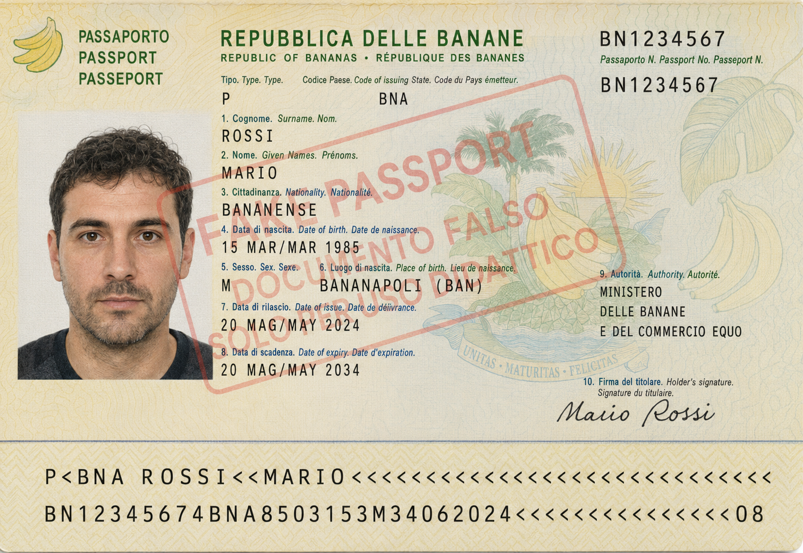
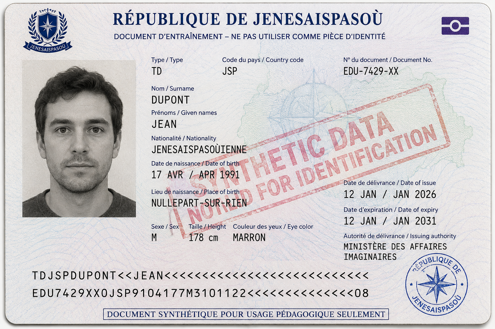
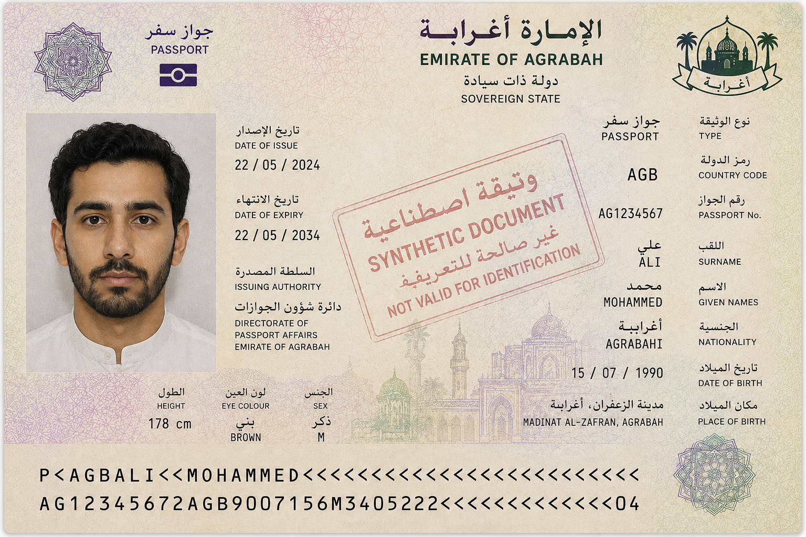

## Running example

### Admission committee assistant for PhD applications evaluation

- 3 candidates, and as many applications, with their _passport_, _transccript of records_, and _presentation letter_ (in natural language)

- we want to extract structured information from these documents (e.g. name, age, grades, research experience, etc.) to ease evaluation

{}
{}

- [Transcript of records](../transcript-mario-rossi.png)
- [Presentation letter](../letter-mario-rossi.txt)
    + letter is very positive
{}
{}

- [Transcript of records](../transcript-jean-dupont.png)
- [Presentation letter](../letter-jean-dupont.txt)
    - letter contains some criticisms
{}
{}

- [Transcript of records](../transcript-mohammed-ali.png)
- [Presentation letter](../letter-mohammed-ali.txt)
    - letter is positive but shallow
{}
{}
